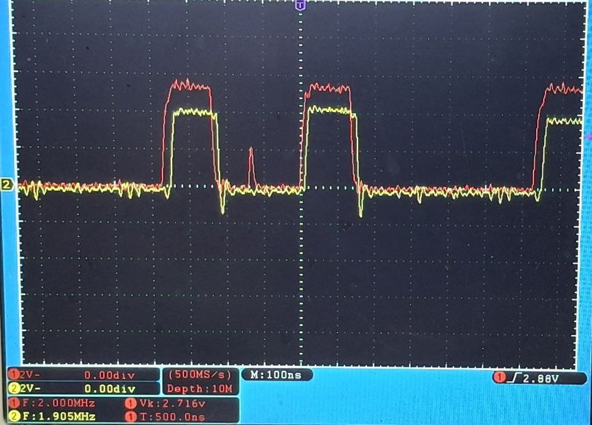
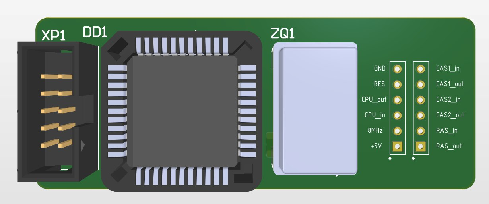
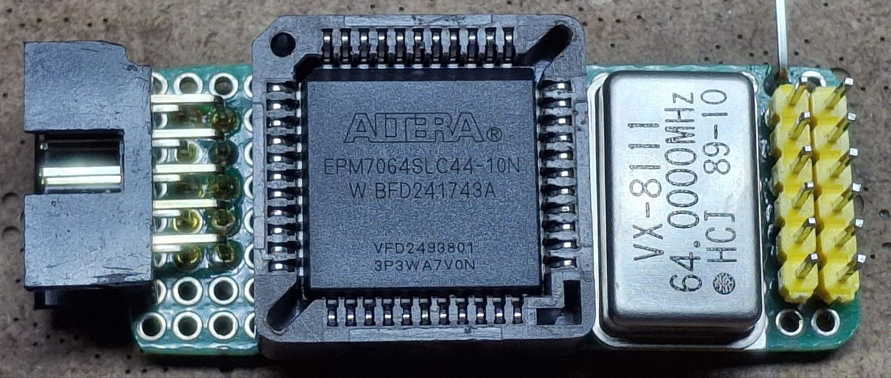
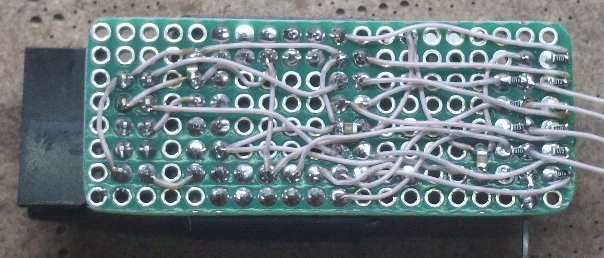

# delta_fix

[](LICENSE)

Проект-эксперимент по «обезглючиванию» компьютера **Дельта 128К** (на БМК).  
Представляет собой программно-аппаратный модуль, который позволяет:

- генерировать тактовый сигнал 8 МГц с регулируемой скважностью (от 1/8 до 7/8);
- вводить управляемую задержку (0–8 периодов 64 МГц) для сигналов `CPU_CLK`, `RAS`, `CAS1`, `CAS2`;
- подавлять короткие импульсы (глитчи) на линиях `RAS`, `CAS` с настраиваемой длительностью фильтра.

Устройство реализовано на ПЛИС (CPLD) и размещается на дополнительной плате, подключаемой к материнской плате компьютера. Репозиторий содержит полный набор файлов для прошивки ПЛИС (Quartus) и печатной платы (Altium Designer).

---

## Функциональность

- **Генератор 8 МГц**  
  Входная частота 64 МГц делится на 8. Параметр `DUTY_8` (1..7) задаёт количество тактов высокого уровня внутри периода 8 МГц. По умолчанию 3 (скважность 3/8 ≈ 37.5%).

- **Задержка сигналов**  
  Для каждого из четырёх сигналов (`CPU_CLK`, `RAS`, `CAS0`, `CAS1`) можно задать задержку в периодах 64 МГц (от 0 до 8). Задержка реализована синхронным сдвиговым регистром.

- **Фильтрация глитчей**  
  Сигналы RAS и CAS проходят через фильтр, который при обнаружении спада (1→0) удерживает выход в нуле в течение заданного числа тактов 64 МГц (`RAS_FILTER`, `CAS0_FILTER`, `CAS1_FILTER`). Это позволяет отсечь короткие помехи на линиях адресации памяти.

Все параметры задаются на этапе синтеза как параметры Verilog-модуля.

---

## Аппаратная часть (HW)

Печатная плата разработана в **Altium Designer** (файл `fix.PrjPCB`).  
Структура папки `HW`:

- `fix.PrjPCB` – главный проект.
- `src/` – исходные файлы схемы (`main.SchDoc`) и платы (`pcb.PcbDoc`).
- `altium_libs/` – библиотеки компонентов (субмодуль).  
  Библиотеки содержат посадочные места, условные обозначения и 3D-модели (папка `3dmodels` со STEP-файлами).  
  Репозиторий использует **git submodule** для подключения библиотек – это упрощает синхронизацию с обновлениями.

Изображения готового прототипа и модели платы можно найти в папке [`media`](#media).

---

## Программируемая часть (FW)

Прошивка для ПЛИС написана на Verilog и предназначена для синтеза в среде **Quartus** (файлы проекта `d_fix.qpf`, `d_fix.qsf`).  
Основной модуль – `d_fix` (файл `src/d_fix.v`). Все задержки и фильтры параметризуются.

### Параметры модуля `d_fix`

| Параметр         | Диапазон | По умолчанию | Описание                                  |
|-------------------|----------|--------------|-------------------------------------------|
| `DUTY_8`          | 1–7      | 3            | Скважность 8 МГц (число тактов high)      |
| `CPU_CLK_DELAY`   | 0–8      | 0            | Задержка CPU_CLK (периодов 64 МГц)        |
| `RAS_DELAY`       | 0–8      | 0            | Задержка RAS                              |
| `RAS_FILTER`      | произв.  | 10           | Длительность фильтра RAS (тактов 64 МГц)  |
| `CAS0_DELAY`      | 0–8      | 1            | Задержка CAS0                              |
| `CAS0_FILTER`     | произв.  | 6            | Фильтр CAS0                                |
| `CAS1_DELAY`      | 0–8      | 1            | Задержка CAS1                              |
| `CAS1_FILTER`     | произв.  | 6            | Фильтр CAS1                                |

### Модули нижнего уровня

- **`signal_delay`** – сдвиговый регистр на 8 позиций с возможностью выбора задержки 0–8 тактов (отрицательный фронт).
- **`glitch_filter`** – детектор спада и счётчик удержания нуля; подавляет импульсы короче заданного числа тактов.

Тестбенч `d_fix_tb.v` демонстрирует работу модуля с генерацией входных сигналов, содержащих короткие импульсы, и проверяет реакцию фильтров и задержек.

---

## Пример использования

Допустим, требуется:
- получить 8 МГц со скважностью 50% (`DUTY_8 = 4`);
- задержать CPU_CLK на 2 такта 64 МГц (≈31 нс);
- на линии RAS установить задержку 1 такт и фильтр 10 тактов (≈156 нс).

Параметры модуля в Verilog задаются так:

```verilog
d_fix #(
    .DUTY_8        (4),
    .CPU_CLK_DELAY (2),
    .RAS_DELAY     (1),
    .RAS_FILTER    (10)
) fix_inst (
    .CLK_64MHZ  (clk_64),
    .reset_n    (rst_n),
    .CLK_8MHZ   (clk_8),
    .CPU_CLK_in (cpu_in),
    .CPU_CLK_out(cpu_out),
    .RAS_in     (ras_in),
    .RAS_out    (ras_out),
    .CAS0_in    (cas0_in),
    .CAS0_out   (cas0_out),
    .CAS1_in    (cas1_in),
    .CAS1_out   (cas1_out)
);

Тестбенч `d_fix_tb.v` показывает, как генерируются сигналы RAS/CAS с иголками и как фильтр их подавляет. Для запуска предусмотрен makefile.

---

## Медиа

В папке [`media`](media) находятся фотографии платы в процессе разработки и готового прототипа.







